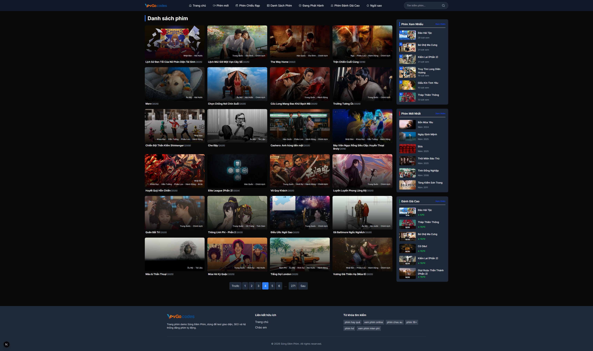
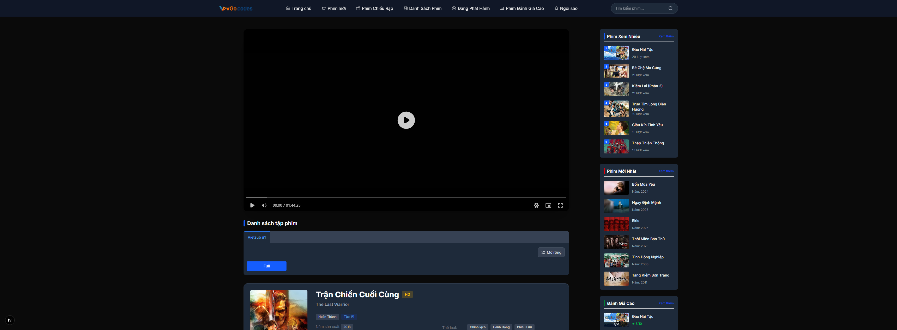
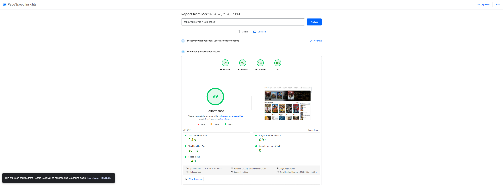

# Hướng Dẫn Triển Khai vTheme Free 002 - vGocms Frontend (Next.js 16)

Bản quyền thuộc về **vgo.codes** - **Personal Telegram Support:** [@apiionline](https://t.me/apiionline)  
- **vGocms Community Group:** [t.me/vgocms](https://t.me/vgocms)  
- **Business Inquiry:** `vgocms@gmail.com`

---

## Giao Diện Demo : [Xem trực tiếp](https://demo-vgo-2.vgo.codes/)

### 1. Trang Chủ


### 2. Trang Chi Tiết Phim


### 3. Tối Ưu Hóa (PageSpeed Insights)


---

## Yêu Cầu Hệ Thống
- Node.js >= 20.x
- Nginx hoặc aaPanel
- PM2

---

## 1. Triển Khai trên aaPanel

### Khởi tạo dự án
Đăng nhập aaPanel, cài đặt **Node.js Version Manager** từ App Store.
Upload mã nguồn lên thư mục trên server, ví dụ: `/www/wwwroot/vtheme-free-001`.

Mở Terminal và thực thi:
```bash
cd /www/wwwroot/vtheme-free-001
npm install
npm run build

```


### Thêm dự án và Setup Domain

1. Vào tab **Website** -> **Node project** -> **Add Node project**.
2. **Project directory:** Chọn `/www/wwwroot/vtheme-free-001`.
3. **Run command:** `npm run start`.
4. **Port:** `3000`.
5. **Domain:** Nhập tên miền của dự án.
6. Nhấn **Submit**. aaPanel sẽ tự động cấu hình Nginx Reverse Proxy.

---

## 2. Triển Khai trên Ubuntu (Systemd) & Cài Đặt Nginx

### Khởi tạo và Build

```bash
cd /var/www/vtheme-free-001
npm install
npm run build

```

### Cài đặt Systemd Service

```bash
nano /etc/systemd/system/vgocms.service

```

```ini
[Unit]
Description=vTheme Free 001 Nextjs Service
After=network.target

[Service]
Type=simple
User=root
WorkingDirectory=/var/www/vtheme-free-001
ExecStart=/usr/bin/npm run start
Restart=on-failure
Environment=PORT=3000
Environment=NODE_ENV=production

[Install]
WantedBy=multi-user.target

```

```bash
systemctl daemon-reload
systemctl enable vgocms
systemctl start vgocms

```

### Cấu Hình Nginx

```bash
nano /etc/nginx/sites-available/vgocms

```

```nginx
server {
    listen 80;
    server_name vgo.codes www.vgo.codes;

    location / {
        proxy_pass [http://127.0.0.1:3000](http://127.0.0.1:3000);
        proxy_http_version 1.1;
        proxy_set_header Upgrade $http_upgrade;
        proxy_set_header Connection 'upgrade';
        proxy_set_header Host $host;
        proxy_cache_bypass $http_upgrade;
    }
}

```

```bash
ln -s /etc/nginx/sites-available/vgocms /etc/nginx/sites-enabled/
nginx -t
systemctl restart nginx

```

---

## 3. Triển Khai trên Windows

Cài đặt Node.js cho Windows. Mở Command Prompt hoặc PowerShell dưới quyền Administrator:

```cmd
cd C:\path\to\vtheme-free-001
npm install
npm run build
npm install -g pm2
pm2 start npm --name "vtheme-free-001" -- run start
pm2 save
pm2 startup

```

## 4. Chạy Thử Nghiệm (Local Development)

Sử dụng `npm run dev` để chạy môi trường phát triển (Hot-reload). Dùng để test giao diện hoặc code trực tiếp trên máy cá nhân (Windows/macOS/Linux).

Mở Command Prompt, PowerShell hoặc Terminal:
```bash
cd /path/to/vtheme-free-001
npm install
npm run dev
```
